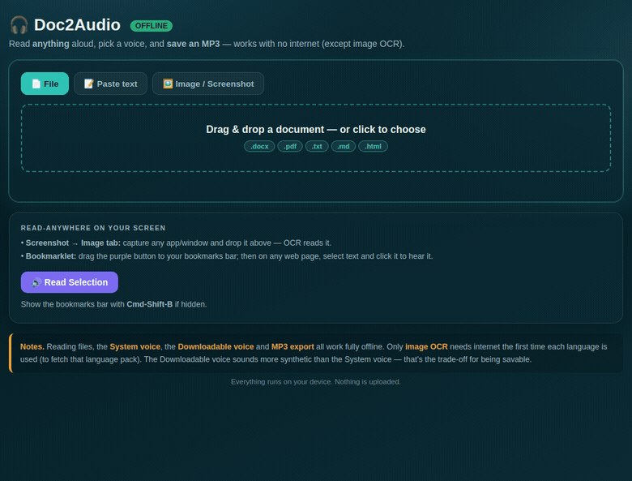

# 🎧 Doc2Audio

**Turn any document into speech — with the reference codes stripped out — so you can just listen.**

## Why

Long technical documents are full of reference codes, requirement IDs and transmittal numbers that
are painful to listen to. Doc2Audio reads the document to you **without** the codes — turning a
dense report into something you can absorb on a commute or while doing something else.

## ✨ Features

- 📄 **Reads anything** — `.docx`, `.pdf`, `.txt`, `.md`, `.html`, pasted text, or an **image / screenshot** (OCR) in many languages, including **Telugu, Hindi, Tamil, Kannada**.
- 🧹 **Strips document codes** — removes reference numbers, requirement IDs, transmittals, revision/version strings, table-of-contents lines and page numbers, while keeping meaningful terms like *L2, M2, E2E*. Toggle it off to read verbatim.
- 🗣️ **Voice choices** — your operating-system voices (best quality) or a savable synthesizer voice with male/female characters, plus speed & pitch.
- 💾 **Save audio** — export an **MP3** from the browser, or a loudness-normalised MP3 in a natural neural voice from the desktop tools.
- 🖱️ **Read anywhere** — select text to read it, or drag the bookmarklet to your bookmarks bar to read selected text on **any web page**.
- 🔒 **Private & offline** — everything runs on your device; nothing is uploaded. (Only image OCR fetches a language pack the first time.)

## 📦 What's included

| Tool | Where | Best for | Install |
|------|-------|----------|---------|
| **Browser app** | [`browser/Doc2Audio_Offline.html`](browser/Doc2Audio_Offline.html) | Quick everyday use; screenshots; MP3 in a browser | None — double-click |
| **macOS tool** | [`desktop/macos/`](desktop/macos/) | Polished MP3 in a natural voice | One-time setup |
| **Windows tool** | [`desktop/windows/`](desktop/windows/) | Polished MP3 in a natural voice | One-time setup |
| **Mobile app (PWA)** | [`mobile/`](mobile/) | Installing on your phone; read on the go | None — installs to home screen |

## 🚀 Quick start — browser app

1. Download **[`browser/Doc2Audio_Offline.html`](browser/Doc2Audio_Offline.html)**.
2. Double-click it — it opens in your browser.
3. Drop a document (or paste text, or drop a screenshot) → pick a voice → **Play**, or **Download MP3**.

Works offline. Only **image OCR** needs internet the first time per language.

## 🖥️ Quick start — desktop (macOS / Windows)

- **macOS:** see [`desktop/macos/README.md`](desktop/macos/README.md) — put the files in a folder, run the one-line setup in Terminal, then drag a document onto **Convert to Audio.command**.
- **Windows:** see [`desktop/windows/README.md`](desktop/windows/README.md) — double-click **Setup.bat** once, then drag a document onto **Convert to Audio.bat**.

Both save `YourDocument (audio).mp3` next to the original, using the natural **Amy** voice (with a built-in system-voice fallback).

## 🧹 How the code-stripping works

It removes tokens that look like codes — anything mixing letters and digits (e.g. `SYS_6136`,
`S00X_0102002`), separator-joined IDs (e.g. `MD-15-80`), bracketed refs (`[P58]`), revision/version
strings, TOC lines, page numbers and contact lines — while **keeping** short meaningful terms such as
`L2`, `M2`, `E2E`. You can switch it off to read the document verbatim.

## 📱 Mobile app (iPhone & Android)

Doc2Audio also runs as an installable **PWA** — it adds to your home screen, runs full-screen, works offline, and keeps every feature (plus "Share to Doc2Audio" to read text from other apps). See [`mobile/MOBILE_GUIDE.md`](mobile/MOBILE_GUIDE.md) for the step-by-step: host it once (Netlify Drop or GitHub Pages), then add it to your phone.

## ❓ FAQ

**Can I save the nice system voice as a file?**
In a browser, no — browsers can only *play* system voices. The browser app's savable voice is a more
synthetic one. For a saved MP3 in a natural voice, use the macOS/Windows tool.

**Is my data uploaded anywhere?**
No. It all runs locally. Image OCR downloads a language model the first time, then works offline.

**Which files work?** `.docx`, `.pdf`, `.txt`, `.md`, `.html`, images (browser OCR), and pasted text.

## 🤝 Contributing

Issues and pull requests are welcome — see [`CONTRIBUTING.md`](CONTRIBUTING.md).

## 📜 License

**GNU GPL-3.0** — see [`LICENSE`](LICENSE). GPL-3.0 is required because the offline browser app bundles
the GPL-licensed meSpeak/eSpeak synthesizer. All bundled components and their licenses are listed in
[`NOTICES.md`](NOTICES.md).

## ⚠️ Disclaimer

Provided as-is, without warranty, and not affiliated with any employer or client. Don't use it on
confidential or access-controlled documents you aren't permitted to process off-system.
